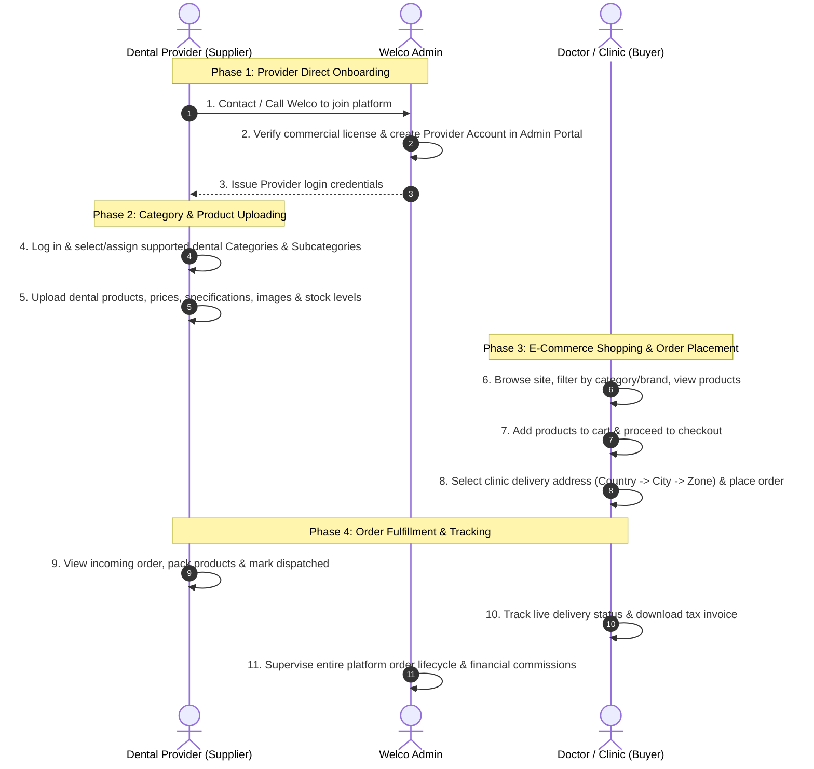
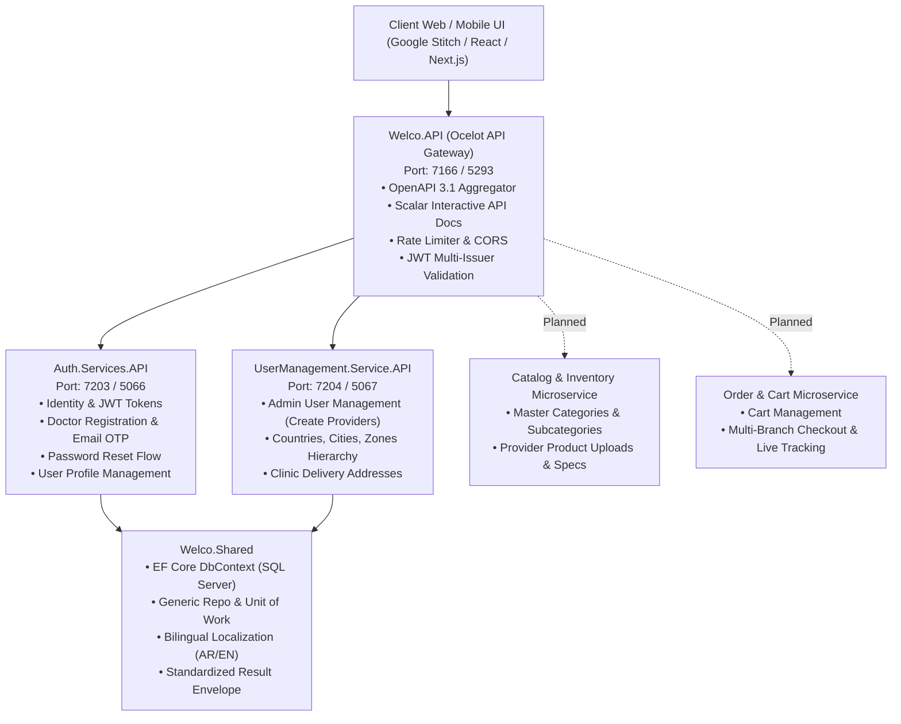

# 🦷 Welco — B2B & B2C Dental E-Commerce Marketplace Platform

> **Welco** is a specialized e-commerce platform and microservices architecture connecting **Dental Equipment & Tool Providers** with **Dentists, Dental Clinics, and Dental Labs**.

---

## 📌 Table of Contents

1. [Exact Business Model & Operational Flow](#-exact-business-model--operational-flow)
2. [Platform Roles & Responsibilities](#-platform-roles--responsibilities)
3. [System Architecture & Microservices](#-system-architecture--microservices)
4. [Current Backend Implementation Status](#-current-backend-implementation-status)
5. [Complete Pages & Screens Breakdown (With Business Benefits)](#-complete-pages--screens-breakdown-with-business-benefits)
6. [🎨 Master Google Stitch UI/UX Design Prompt](#-master-google-stitch-uiux-design-prompt)
7. [Running the Project Locally](#-running-the-project-locally)

---

## 🏢 Exact Business Model & Operational Flow



---

## 👥 Platform Roles & Responsibilities

| Role | Access Level | Key Responsibilities |
| :--- | :--- | :--- |
| **Super Admin** | Admin Management Portal (`/admin/*`) | • Manages and creates Provider accounts after direct call/vetting.<br/>• Creates and organizes master dental Categories & Subcategories.<br/>• Monitors all marketplace orders, doctor accounts, and geographic locations (Countries, Cities, Zones). |
| **Dental Provider** | Provider Vendor Portal (`/provider/*`) | • Logs into the verified account created by Admin.<br/>• Selects supported Categories & Subcategories.<br/>• Uploads and manages dental products, prices, stock, and clinical specs.<br/>• Receives, fulfills, and dispatches doctor orders. |
| **Doctor / Clinic** | Public E-Commerce Storefront (`/`, `/catalog`, `/cart`, `/checkout`, `/account/*`) | • Registers account with email OTP verification.<br/>• Browses and searches dental catalog by categories, brands, and suppliers.<br/>• Adds items to cart, selects clinic delivery addresses, and completes checkout.<br/>• Tracks order fulfillment and downloads invoices. |

---

## 🏗 System Architecture & Microservices



---

## 🚀 Current Backend Implementation Status

### ✅ Completed & Tested Backend Modules:

1. **`Welco.API` (API Gateway)**:
   - Dynamic downstream route merging (`ocelot.auth.json`, `ocelot.usermanagement.json`).
   - Resilient live + offline OpenAPI 3.1 schema aggregation with persistent disk cache in `Ocelot/Cache/`.
   - Unified interactive Scalar documentation at `/scalar/v1`, `/docs/auth`, and `/docs/usermanagement`.
   - Centralized CORS policies, Rate Limiting, Security Headers, and Request Localization middleware.

2. **`Auth.Services.API` (Authentication & Security Microservice)**:
   - **User Registration** (`POST /api/v1/auth/register`) with automatic 6-digit email OTP generation.
   - **OTP Verification** (`POST /api/v1/auth/verify-register-otp`) to activate accounts.
   - **Login & Token Issuance** (`POST /api/v1/auth/login`) generating JWT access tokens + secure refresh tokens.
   - **Token Refreshing** (`POST /api/v1/auth/refresh-token`) with rotation.
   - **Forgot & Reset Password Flow** (`POST /api/v1/auth/forgot-password`, `POST /api/v1/auth/verify-password-otp`, `POST /api/v1/auth/reset-password`).
   - **User Profile Management** (`GET /api/v1/auth/profile`, `PUT /api/v1/auth/profile`) with clinic address mapping and defensive error handling.

3. **`UserManamgent.Service.API` (User & Geographic Microservice)**:
   - **User Management** (`GET /api/v1/user-management/users`, `GET {id}`, `POST`, `PUT {id}`, `DELETE {id}`, `PUT {id}/change-password`).
   - **Geographical Hierarchy**:
     - Countries (`/api/v1/user-management/countries`)
     - Cities by Country (`/api/v1/user-management/cities`, `country/{countryId}`)
     - Zones / Districts by City (`/api/v1/user-management/zones`, `city/{cityId}`)
   - **User / Clinic Delivery Addresses** (`/api/v1/user-management/addresses`, `user/{userId}`) with full relational cascade rules.

4. **`Welco.Shared` (Shared Core Infrastructure)**:
   - Standardized `Result<T>` envelopes (`isSuccess`, `statusCode`, `message`, `errors`, `data`).
   - Centralized `WelcoDbContext` with full audit trails (`CreatedBy`, `CreatedAt`, `UpdatedBy`, `UpdatedAt`, `DeletedAt`), soft delete global query filters.
   - Multi-language resource bundles (`messages.en.json`, `messages.ar.json`) supporting English and Arabic.

---

## 📱 Complete Pages & Screens Breakdown (With Business Benefits)

### 🛒 1. Public Storefront & Doctor E-Commerce Experience

| Screen # | Screen Name & Route | Key UI Features & Elements | Specific Business & User Benefit |
| :---: | :--- | :--- | :--- |
| **1.1** | **Marketplace Home**<br/>`/` | • Hero section with dental tools showcase.<br/>• "Call Us to Partner" banner for new providers.<br/>• Dental category grid & top brands.<br/>• Smart search bar with auto-suggest. | **Instant Engagement & Provider Lead Gen**: Welcomes dentists with clear product navigation while giving prospective suppliers an immediate channel to call Welco. |
| **1.2** | **"Become a Provider" Contact Page**<br/>`/become-a-provider` | • Welco supplier hotline & contact form.<br/>• Overview of marketplace benefits for distributors.<br/>• Request callback for commercial vetting. | **High-Quality Vendor Ingestion**: Filters suppliers through direct phone/meeting consultation before accounts are generated. |
| **1.3** | **Dental Category & Catalog Page**<br/>`/catalog` | • Category tree navigation (e.g. Endodontics, Implants, Restorative).<br/>• Brand, price, and stock filters.<br/>• Product cards with pricing and "Add to Cart". | **Effortless Product Discovery**: Allows doctors to find specific clinic tools without browsing irrelevant medical supplies. |
| **1.4** | **Product Details Page (PDP)**<br/>`/product/:slug` | • High-resolution image zoom & clinical specs.<br/>• Provider information & stock availability.<br/>• Technical data sheet & sterilization instructions.<br/>• Quantity counter & "Add to Cart" button. | **Purchasing Confidence**: Gives the doctor all technical and regulatory details needed to approve clinical use. |
| **1.5** | **Clinic Shopping Cart**<br/>`/cart` | • Item list grouped by provider.<br/>• Quantity adjustments & subtotal calculation.<br/>• Free delivery threshold indicator.<br/>• "Proceed to Checkout" action. | **Order Accuracy**: Lets doctors review their clinic consumable quantities and supplier packages before placing orders. |
| **1.6** | **Multi-Step Checkout**<br/>`/checkout` | • Select saved clinic branch address (Country &rarr; City &rarr; Zone).<br/>• Shipping speed selection (Standard / Express).<br/>• Payment options (Card, Apple Pay, Cash on Delivery, Bank Transfer).<br/>• Order summary & tax calculation. | **Fast, Reliable Clinic Purchasing**: Eliminates typing addresses manually on repeat orders by binding saved clinic delivery addresses. |
| **1.7** | **Order Tracking & Invoice Vault**<br/>`/account/orders` | • Chronological list of orders.<br/>• Visual progress bar (Placed &rarr; Confirmed &rarr; Dispatched &rarr; Delivered).<br/>• Download official VAT Tax Invoices. | **Full Transparency & Easy Accounting**: Keeps clinics updated on when urgent consumables will arrive and simplifies monthly bookkeeping. |
| **1.8** | **Doctor Registration & OTP Verification**<br/>`/auth/register` | • Doctor registration form (Name, Email, Password, Dental License ID).<br/>• 6-digit email OTP verification screen.<br/>• Password reset flow. | **Verified Healthcare Access**: Ensures that prescription anesthetics and specialized surgical tools are sold only to certified doctors. |

---

### 🏭 2. Dental Supply Provider Portal (`/provider/*`)

| Screen # | Screen Name & Route | Key UI Features & Elements | Specific Business & Operational Benefit |
| :---: | :--- | :--- | :--- |
| **2.1** | **Provider Overview Dashboard**<br/>`/provider/dashboard` | • Month-to-date sales and active orders counter.<br/>• Top-selling products chart.<br/>• Low stock alerts and recent doctor orders stream. | **Operational Command Center**: Gives suppliers a real-time pulse of their daily sales, pending shipments, and inventory health. |
| **2.2** | **My Categories & Subcategories**<br/>`/provider/categories` | • Multi-select tree of supported dental categories (e.g. Endodontic Files, Autoclaves, Composite Resins).<br/>• "Save Category Scope" action. | **Targeted Catalog Alignment**: Restricts provider uploads strictly to the medical categories they are licensed and authorized to distribute. |
| **2.3** | **Product Catalog & Inventory Manager**<br/>`/provider/products` | • Data table of all provider listings (SKU, Image, Title, Category, Price, Stock Level, Status).<br/>• Filter by Category or Out-of-Stock. | **Full Stock Control**: Prevents overselling and allows suppliers to update prices and availability in real time. |
| **2.4** | **Add / Edit Dental Product Screen**<br/>`/provider/products/new` | • Category & Subcategory dropdown (based on provider's selected categories).<br/>• Product title, clinical description, images.<br/>• Price, stock quantity, SKU, batch number, and expiration date. | **Structured Clinical Data**: Ensures every product uploaded contains the mandatory regulatory, batch, and pricing details. |
| **2.5** | **Order Fulfillment & Dispatch**<br/>`/provider/orders` | • Pending orders list awaiting packing.<br/>• Order detail drawer with clinic delivery address.<br/>• "Mark as Packed", "Generate Packing Slip", and "Mark Dispatched" actions. | **Fast Order Turnaround**: Guides the warehouse team through packing and shipping steps to ensure fast clinic fulfillment. |
| **2.6** | **Provider Sales & Earnings**<br/>`/provider/earnings` | • Total gross sales, marketplace commission deductions, net payout balance.<br/>• Historical payout records. | **Financial Transparency**: Vendors clearly see their earnings and payouts after platform fee deductions. |

---

### 🛡️ 3. Platform Admin Management Portal (`/admin/*`)

| Screen # | Screen Name & Route | Key UI Features & Elements | Specific Business & Operational Benefit |
| :---: | :--- | :--- | :--- |
| **3.1** | **Admin Executive Dashboard**<br/>`/admin/dashboard` | • Platform Gross Merchandise Value (GMV), Total Orders, Active Providers, Active Clinics.<br/>• Visual sales growth charts and recent order logs. | **Executive Oversight**: Provides platform owners with complete business metrics and real-time transaction volume. |
| **3.2** | **Provider Onboarding & Management**<br/>`/admin/providers` | • Directory of registered suppliers.<br/>• **"Onboard New Provider" Modal** (creates supplier account after phone consultation, assigns login credentials and commercial details).<br/>• Provider activation / suspension toggles. | **Controlled Onboarding**: Enforces manual phone/contract vetting so only legitimate, authorized dental distributors join. |
| **3.3** | **Master Category & Taxonomy Tree**<br/>`/admin/categories` | • Visual tree editor to create, edit, and reorder master Categories and Subcategories.<br/>• Assign category icons and medical attributes. | **Centralized Data Structure**: Maintains a clean, uniform catalog structure across all different suppliers. |
| **3.4** | **Doctor & Buyer Account Directory**<br/>`/admin/doctors` | • List of registered doctors and clinics.<br/>• License verification status and order history.<br/>• Account management actions. | **Customer Support & Verification**: Enables admin staff to assist clinics and verify medical credentials when needed. |
| **3.5** | **Master Order Supervision**<br/>`/admin/orders` | • Global view of all platform orders across all providers.<br/>• Filter by status (Pending, Packed, Dispatched, Delivered).<br/>• Order issue resolution and customer assistance desk. | **Dispute & SLA Resolution**: Ensures orders are fulfilled on time and allows platform admins to intervene if a provider delays dispatch. |
| **3.6** | **Geographic Locations Manager**<br/>`/admin/geography` | • Countries, Cities, and Zones management.<br/>• Enable/disable specific delivery zones. | **Logistics Scalability**: Powers the address dropdowns and ensures accurate localized deliveries. |

---

## 🎨 Master Google Stitch UI/UX Design Prompt

> **Instructions for Use**: Copy the prompt block below directly into **Google Stitch**, **Figma AI**, **v0.dev**, or any AI UI generator to generate pixel-perfect screens matching this exact workflow.

```markdown
================================================================================
GOOGLE STITCH UI/UX MASTER PROMPT: WELCO DENTAL MARKETPLACE PLATFORM
================================================================================

# 1. PLATFORM CONTEXT & OPERATIONAL MODEL
You are a Principal Product Designer & UI/UX Architect designing "Welco" — an enterprise Dental E-Commerce Marketplace.
Business Rules:
1. Providers (Suppliers) contact Welco via phone / inquiry to join. The Admin manually creates and onboards Provider accounts in the Admin Portal.
2. The Provider logs into their dashboard, selects the Categories/Subcategories they supply, and uploads dental products under those categories.
3. Doctors & Dental Clinics browse the storefront, search by category/brand, add products to cart, select clinic delivery addresses (Country -> City -> Zone), and place orders.
4. The Provider fulfills and dispatches orders; the Doctor tracks live delivery status and downloads tax invoices; the Admin oversees the entire marketplace.

# 2. DESIGN TOKENS & VISUAL IDENTITY
- **Aesthetic**: Modern, clean, trustworthy clinical medical aesthetic with a high-end e-commerce feel (Shopify Plus meets Medical Equipment Exchange).
- **Color Palette**:
  - Primary Brand (Teal Cyan): #0891B2 (Cyan 600) / #0E7490 (Cyan 700)
  - Secondary Brand (Surgical Blue): #2563EB (Blue 600) / #1D4ED8 (Blue 700)
  - In-Stock / Success Green: #059669 (Emerald 600)
  - Warning / Expiry / Low Stock: #D97706 (Amber 600)
  - Background Canvas: #F8FAFC (Slate 50)
  - Cards & Modals: #FFFFFF (White) with border #E2E8F0
  - Dark Elements: #0F172A (Slate 900)
  - Typography: Inter (English LTR) and Readex Pro (Arabic RTL) with instant language toggle.

---

# 3. SCREEN SPECIFICATIONS BY USER ROLE

## A. PUBLIC & DOCTOR STOREFRONT
- **Screen 1 (Marketplace Home)**: Top bar with provider hotline ("Want to sell? Call +966-XXX-XXXX"), auto-suggest search bar, dental categories grid, top brands carousel, featured clinical deals, cart drawer trigger.
- **Screen 2 ("Become a Provider" Contact Page)**: Supplier partnership overview, callback request form, direct phone and WhatsApp contact cards.
- **Screen 3 (Catalog & Category Page)**: Category tree sidebar, brand/price/stock filters, product cards with image, stock badge, single unit vs bulk clinic price, "Add to Cart" button.
- **Screen 4 (Product Detail Page)**: High-res zoom gallery, clinical specifications table, sterilization protocols tab (134°C autoclave cycles), supplier info, delivery calculator (Country -> City -> Zone), "Add to Cart" button.
- **Screen 5 (Clinic Shopping Cart)**: Items grouped by provider, quantity counter, free delivery meter, subtotal calculation, "Proceed to Checkout".
- **Screen 6 (Multi-Step Checkout)**: Step 1: Select clinic branch delivery address; Step 2: Shipping method; Step 3: Payment method (Card, Mada, Apple Pay, Cash on Delivery, Bank Transfer); Step 4: Order confirmation.
- **Screen 7 (Doctor Account & Order Tracking)**: Orders table, live tracking timeline (Placed -> Packed -> Dispatched -> Delivered), PDF invoice download button.
- **Screen 8 (Doctor Auth & Email OTP)**: Registration with Dental License number, 6-digit email OTP verification screen, login with JWT token support.

## B. DENTAL PROVIDER PORTAL (`/provider/*`)
- **Screen 9 (Provider Dashboard)**: Sales overview KPIs, active orders count, low stock warnings, recent orders stream.
- **Screen 10 (My Categories & Subcategories)**: Multi-select tree of supported dental categories (e.g., Endodontics, Autoclaves, Restorative) with save button.
- **Screen 11 (Product Catalog & Stock Manager)**: Product table with SKU, image, title, category, price, stock quantity, and status.
- **Screen 12 (Add/Edit Product Modal/Page)**: Category dropdown (filtered to provider's assigned categories), title, clinical specs, images, price, stock, batch/lot number, expiration date.
- **Screen 13 (Order Fulfillment Workspace)**: Incoming orders list, packing slip generator, "Mark Packed", "Mark Dispatched with Courier".
- **Screen 14 (Sales & Earnings)**: Net earnings summary, platform fee deductions, payout history.

## C. PLATFORM ADMIN PORTAL (`/admin/*`)
- **Screen 15 (Admin Dashboard)**: Platform GMV, total orders, active providers, active doctors, sales growth chart.
- **Screen 16 (Provider Onboarding & Management)**: Directory of suppliers, "Onboard New Provider" modal (input commercial name, phone, email, and generate login credentials after phone vetting).
- **Screen 17 (Master Category & Taxonomy Tree)**: Visual category/subcategory manager with drag-and-drop hierarchy and icon assigner.
- **Screen 18 (Doctor Account Management)**: Registered clinics directory with license verification status.
- **Screen 19 (Master Order Supervision)**: Global order monitoring across all suppliers with status filters and dispute handling.
- **Screen 20 (Geographic Delivery Locations)**: Countries, Cities, and Zones management table.

---

# 4. COMPONENT ARCHITECTURE & DESIGN DETAILS
- All forms must have floating labels, inline error validation, and accessible focus rings (#0891B2).
- Empty states must show friendly dental-themed illustrations (e.g. empty cart with dental mirror).
- Skeleton loading shimmers must match exact card and table dimensions.
- Full RTL (Right-to-Left) mirroring for Arabic with Readex Pro font.
================================================================================
```

---

## 💻 Running the Project Locally

### Prerequisites
- [.NET 10 SDK](https://dotnet.microsoft.com/download/dotnet/10.0)
- Microsoft SQL Server (configured in `appsettings.Development.json`)

### Option 1: Visual Studio
1. Open `Welco.sln`.
2. Configure multiple startup projects:
   - `Auth.Services.API` &rarr; **Start**
   - `UserManamgent.Service.API` &rarr; **Start**
   - `Welco.API` (Gateway) &rarr; **Start**
3. Press **F5**.
4. Access the interactive documentation at `https://localhost:7166/scalar/v1`.

### Option 2: Terminal / PowerShell
```powershell
# Terminal 1: Auth Microservice
dotnet run --project "Auth.Services.API/Auth.Services.API.csproj" --launch-profile https

# Terminal 2: User Management Microservice
dotnet run --project "UserManamgent.Service.API/UserManamgent.Service.API.csproj" --launch-profile https

# Terminal 3: Welco API Gateway
dotnet run --project "Welco.API/Welco.Gateway.API.csproj" --launch-profile https
```

---

## 📄 License & Intellectual Property
Copyright &copy; 2026 **Welco Platform**. All rights reserved.
